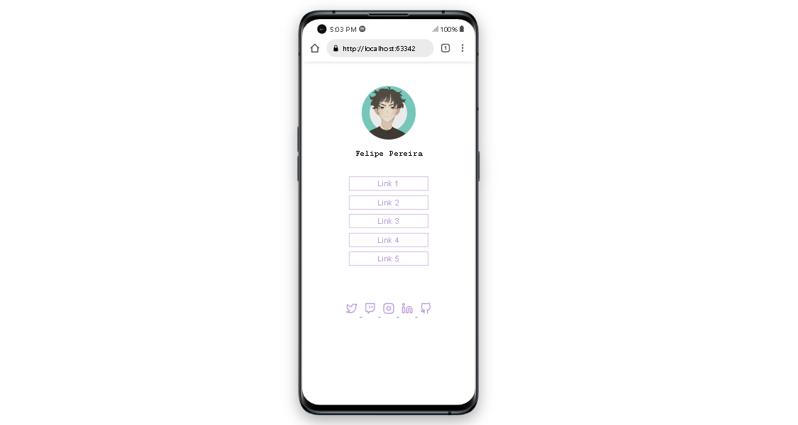

<h1>💻 ROCKETSEAT TREE SOCIAL CHALLENGE</h1>

## Introduction

<a href="https://app.rocketseat.com.br">Rocketseat</a> Social Tree Project. Discover course challenge 2nd module

## Techs

Technologies used:
* [Html](https://html.com/): Linguagem de Marcação de Hipertexto;
* [Css](https://www.w3.org/Style/CSS/Overview.en.html): Cascading Style Sheets é um mecanismo para adicionar estilo a um documento web;

## Autor

| [ Felipe Pereira](https://github.com/felipepx) |
| :-------------------------------------------------------------------------------------------------------------------------------------------------------------------------: |
